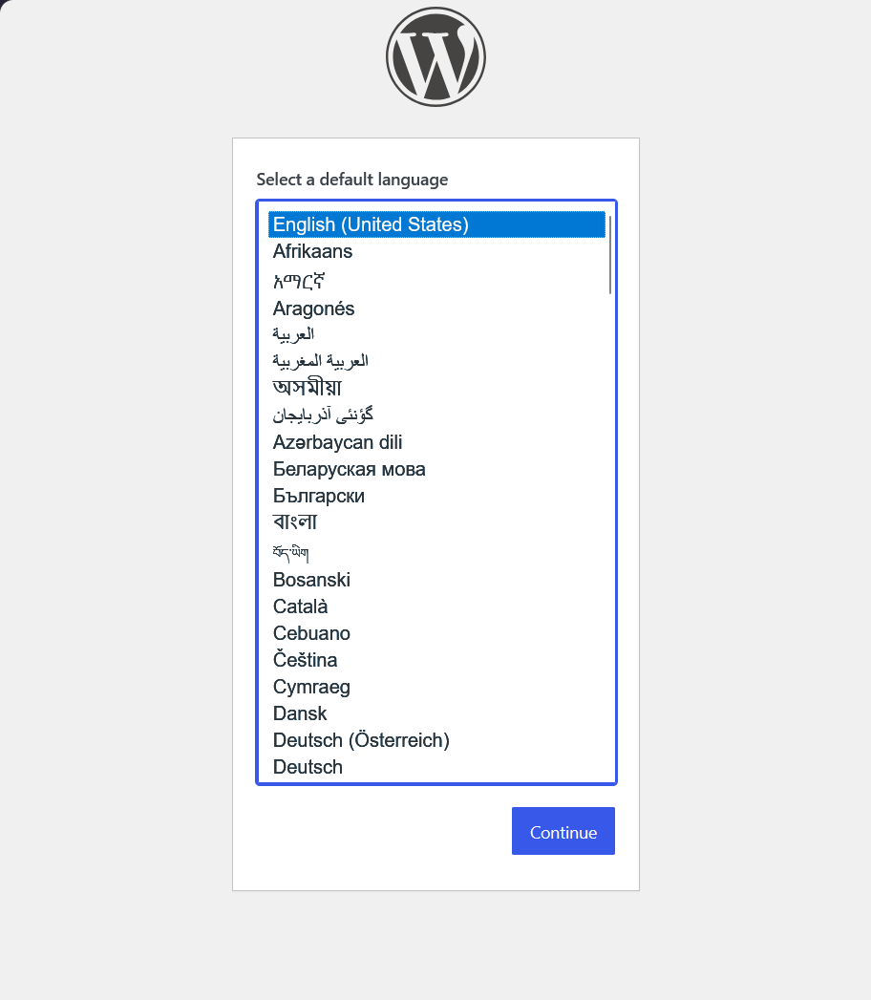
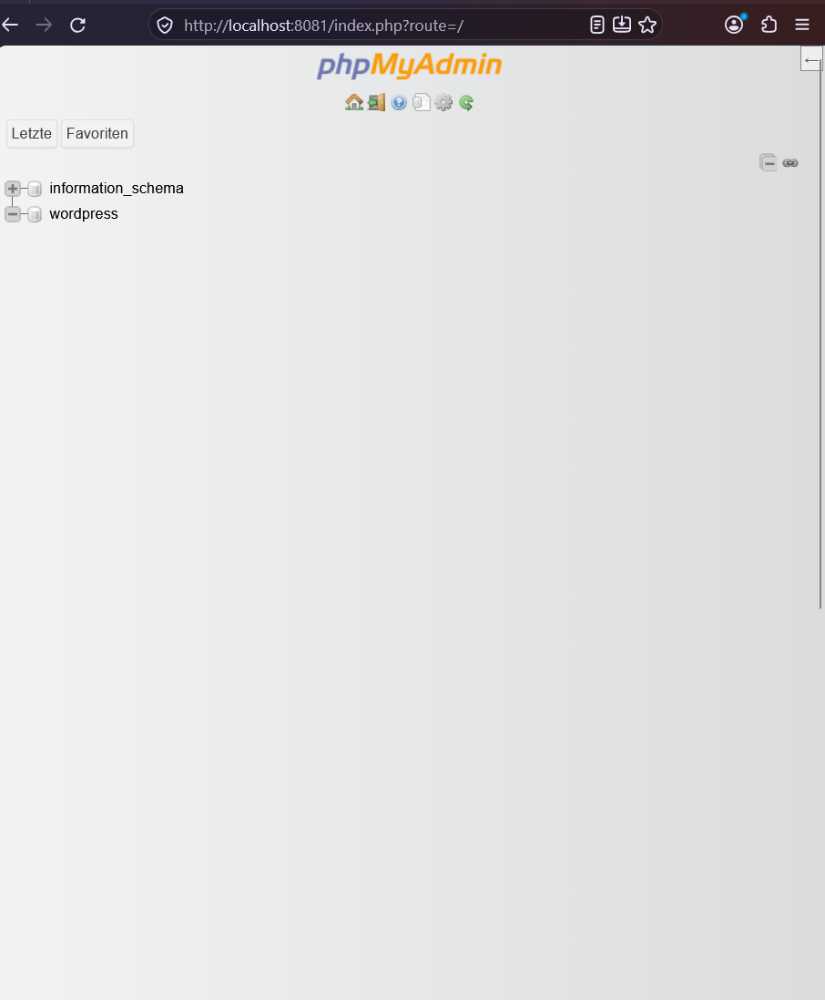

# WordPress Entwicklungsumgebung

Dieses Projekt stellt eine lokale Entwicklungs- und Testumgebung für WordPress bereit.

Die Umgebung läuft mit Docker Compose und besteht aus:

- WordPress
- MariaDB
- phpMyAdmin

Dadurch können Änderungen und Konfigurationen lokal getestet werden, ohne am produktiven WordPress-System zu arbeiten.

## Voraussetzungen

- Docker Desktop
- Docker Compose
- Git

## Einrichtung

Repository klonen und in den Projektordner wechseln.

Anschließend die `.env.example` als `.env` kopieren:

```bash
cp .env.example .env
```

Danach müssen in der `.env` eigene lokale Zugangsdaten eingetragen werden.

Beispiel:

```env
DB_NAME=wordpress
DB_USER=wordpress
DB_PASSWORD=CHANGE_ME
DB_ROOT_PASSWORD=CHANGE_ME
```

Die `.env` wird nicht in Git gespeichert, da sie Zugangsdaten enthält.

## Konfiguration prüfen

```bash
docker compose config
```

## Umgebung starten

```bash
docker compose up -d
```

Status der Container prüfen:

```bash
docker compose ps
```

## Zugriff

WordPress:

`http://localhost:8080`

phpMyAdmin:

`http://localhost:8081`

Für die Anmeldung an phpMyAdmin werden `DB_USER` und `DB_PASSWORD` aus der lokalen `.env` verwendet.

## Persistenz

Für die MariaDB-Daten wird das Named Volume `db_data` verwendet.

Der Ordner `wordpress/wp-content` wird als Bind-Mount eingebunden. Dadurch können WordPress-Inhalte direkt auf dem Host bearbeitet werden.

## Screenshots

### WordPress

Screenshot des WordPress-Installers:



### phpMyAdmin

Screenshot von phpMyAdmin:



## Umgebung stoppen

```bash
docker compose down
```

Das Named Volume mit den Datenbankdaten bleibt dabei erhalten.